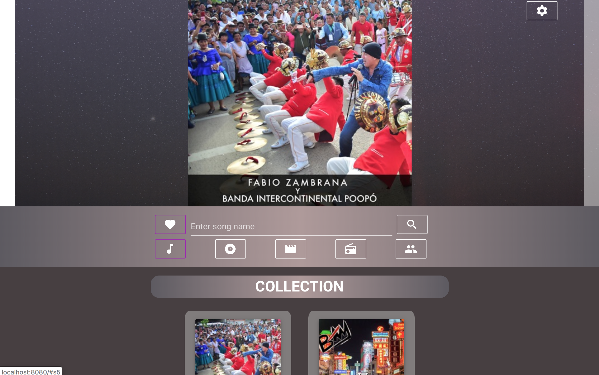

# iTunes Explorer

<p align="center">
    
</p>

## iTunes Search built with [Vue.js](https://vuejs.org/)

## Project setup
```
npm install
```

### Compiles and hot-reloads for development
```
npm run serve
```

### Compiles and minifies for production
```
npm run build
```

### Run your tests
```
npm run test
```

### Browser Compatibility
```
Works Best on Chrome, Edge 18. 
Minor Issues observed on Safari.
Major issues observed on Firefox, IE11.
```
